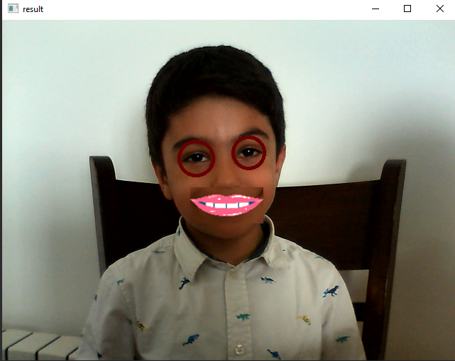

# Face Detector


A simple face detector project using opencv with python.


## python

This project is written in Python version 3.10.8

I have used the [opencv](https://pypi.org/project/opencv-python/) library for this project


### **How to install**
---

Run following commands:
 ```
pip install -r requierments.txt
 ```
### **My Projects**
 ---

**First**   :   **Drawing a football pitch**


### **How to Run**
excecute this command in terminal:
 ```
 footbal_pitch\main.py
  ```
   

### **result**
---


---


**Second**   :   **Cat Face Detector**


### **How to Run**
excecute this command in terminal:
 ```
 cat\main.py
  ```
### **input**   

### **result**
---


---
**Theard**   :   **Face Detection**


### **How to Run**
excecute this command in terminal:
 ```
 webcam\main.py
  ```

### **result**
---

Chess-board face

---
Stickers on eyes and lips

---
A non-square sticker on the face

---
Mirror filter
